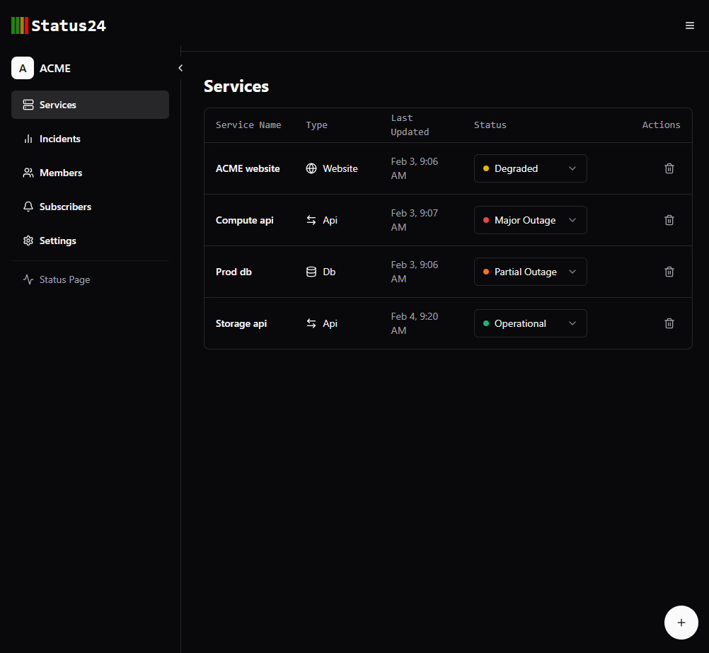

#  Status24

Status24 is an system monitoring and incident communication platform that helps to communicate real-time status and outages to users.

## Screenshots

[]()




## Tech Stack

- Authentication - Clerk
- Backend - Python, FastAPI
- Frontend - React, React router, Zustand
- UI - Tailwind CSS, Shadcn
- Database - Firebase
- Hosting - Vercel, Render

## Setup guide

### Clerk

- Create clerk project and get publishable and api keys.
- Enable organization features.

### Firebase Setup

- Backend sdk setup [https://firebase.google.com/docs/firestore/quickstart#python]
- Create new firebase project, create web app and enable firestore. [https://firebase.google.com/docs/web/setup]
- Set firestore rules.

```bash
rules_version = '2';

service cloud.firestore {
  match /databases/{database}/documents {
    // This rule allows anyone to read any document in your Firestore database.
    match /{document=**} {
      allow read: if true;  // Allow read access to everyone.
      allow write: if false; // Write access is still disabled.
    }
  }
}
```


### Backend 

```bash
git clone https://github.com/dineshkidd/status24.git
cd startus24
pip install -r requirements.txt
```

- create .env file

```
GOOGLE_APPLICATION_CREDENTIALS=<firebase sdk config json file dir>
CLERK_API_KEY=<clerk api key>
```

- Run the application

```bash
uvicorn main:app
```


### Frontend

```bash
cd Frontend
npm i
```

- create .env file

```bash
VITE_API_URL= <fastapi backend url>
VITE_CLERK_PUBLISHABLE_KEY = 
VITE_FIREBASE_API_KEY = 
VITE_FIREBASE_AUTH_DOMAIN =  
VITE_FIREBASE_PROJECT_ID = 
VITE_FIREBASE_STORAGE_BUCKET = 
VITE_FIREBASE_MESSAGING_SENDER_ID = 
VITE_FIREBASE_APP_ID = 
VITE_FIREBASE_MEASUREMENT_ID = 

```

- Run the appication.

```bash
npm run dev
```


